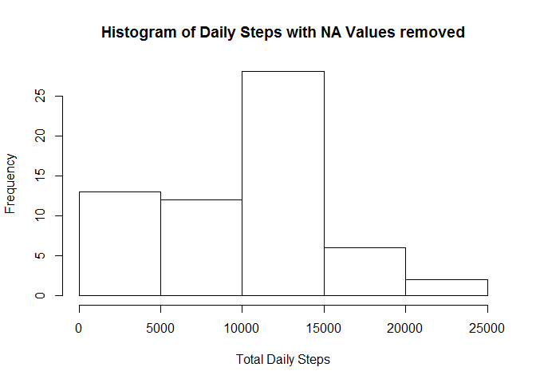
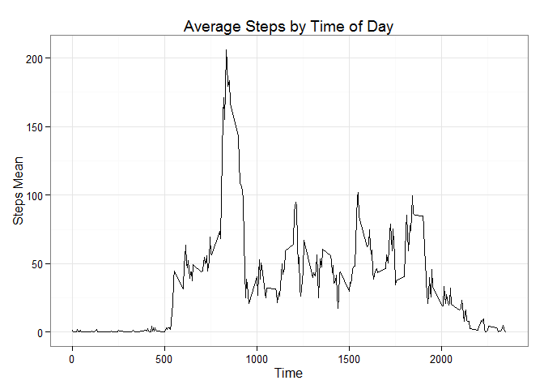
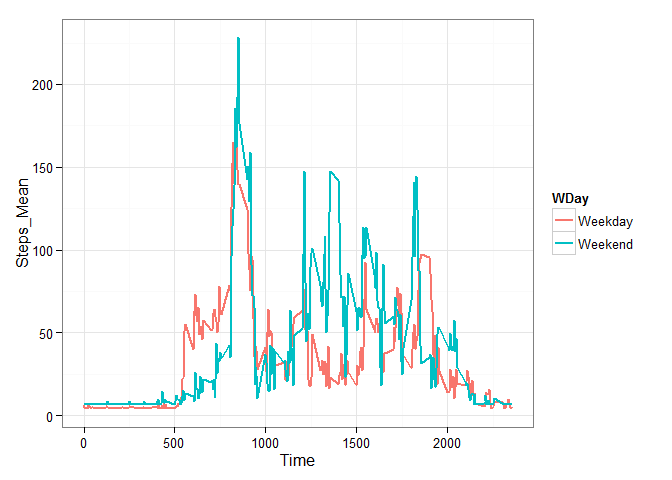
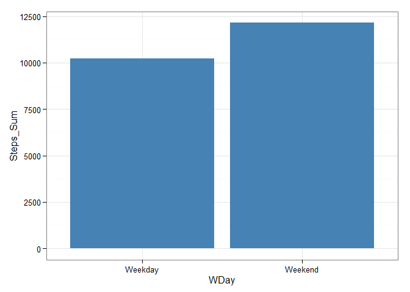

# Reproducible Research: Peer Assessment 1


## Loading and preprocessing the data


```r
# Package Loading
library(dplyr)
```

```
## 
## Attaching package: 'dplyr'
## 
## The following object is masked from 'package:stats':
## 
##     filter
## 
## The following objects are masked from 'package:base':
## 
##     intersect, setdiff, setequal, union
```

```r
library(ggplot2)
library(lubridate)


activity <- read.csv("activity.csv", na.strings="NA") # File Reading
activity$date <- as.Date(activity$date, "%Y-%m-%d") # Date format fixing


act_tbl <- tbl_df(activity) #data.frame to data.table
```


## What is mean total number of steps taken per day?


```r
Daily_Steps_Sum <- act_tbl %>% group_by(date) %>% 
        summarize(Steps_Sum=sum(steps, na.rm=T)) # na.rm=T
mean_steps <- mean(Daily_Steps_Sum$Steps_Sum, na.rm=T)
median_steps <- median(Daily_Steps_Sum$Steps_Sum, na.rm=T)

mean_steps
```

```
## [1] 9354.23
```

```r
median_steps
```

```
## [1] 10395
```
The mean total number of steps taken per day was 9354.2295082 steps.

The median total number of steps taken per day was 10395 steps.


## What is the average daily activity pattern?


```r
hist(Daily_Steps_Sum$Steps_Sum, xlab="Total Daily Steps", 
     main = "Histogram of Daily Steps with NA Values removed")
```

 

Without REPLACING the NA values, activity ranges from no activity to up to 25 thousands steps.

There should be noted the diference between replacing and removing NA Values.

By removing the NA values the Sum and Avereage will be done without that data.
By replacing them, there will be some data in that cell.  Depending on the used technique to replace the NA values
propably there won't be a big change in average values.  But there will definataly be a change in sum values.

The biggest frequency of daily steps is in the 10 to 15 thousands ranges, which represents
the middle interval.

At first glance, the histogram doesn't show a normal distribution.


```r
act_interval <- act_tbl %>% group_by(interval) %>% 
        summarize(Steps_Mean=mean(steps, na.rm=T))

plot2 <- ggplot(act_interval, aes(x= interval, y=Steps_Mean))
plot2 + geom_line() + theme_bw() + xlab("Time") + ylab("Steps Mean") + 
        ggtitle("Average Steps by Time of Day")
```

 

From the previous plot it can be noted that little activity is performed after 8pm. From 10 pm to 5 am almost
no activity is performed. This is expected beacuse of sleeping hours.

There is a big spike in activity from around 8am to 9:30 am


```r
max_interval <- act_interval %>% filter(Steps_Mean == max(Steps_Mean))
max_interval
```

```
## Source: local data frame [1 x 2]
## 
##   interval Steps_Mean
## 1      835   206.1698
```

The maximum average daily activity is perfomed at 835 am and corresponds to
206.1698113 steps 

## Imputing missing values

The code strategy used to replace NA values was a simple one.  Detect NA values with an "ifelse" command.
In case a step value is NA it will be replace by a mean of the steps values, if not, it will keep it's original value.

There definitaly could be more advance way to replace this value, for example replacing it with the mean weekday and 
time value. But this time I didn't do it that way.


```r
tbl_wona <- act_tbl %>% mutate(steps = ifelse(is.na(act_tbl$steps), 
                                                    mean(steps, na.rm=TRUE) , steps ))
Daily_Steps_Sum2 <- tbl_wona %>% group_by(date) %>% 
        summarize(Steps_Sum=sum(steps, na.rm=T))

hist(Daily_Steps_Sum2$Steps_Sum, xlab="Total Daily Steps", 
        main = "Histogram of Daily Steps with Replaced NA values")
```

 

When NA values are replace, the histogram shape distribution changes as expected.
The days were data wasn't recorded now instead of having 0 steps, they have a number. 

The biggest "looser" with this methodology is the interval with 0 to 5000 steps.
And the bigest "winner" is the middle interval, with the range of 10 000 to 15 000 steps.

## Are there differences in activity patterns between weekdays and weekends?


```r
tbl_wkdy <- tbl_wona %>% mutate(Weekday = as.numeric(wday(date))) %>% 
        mutate(WDay = ifelse(Weekday >0 & Weekday <6, "Weekday", "Weekend"))
tbl_wkdy_mean <- tbl_wkdy %>% group_by(WDay, interval) %>% 
        summarize(Steps_Mean=mean(steps, na.rm=T))
tbl_wkdy_sum <- tbl_wkdy_mean %>% group_by(WDay) %>% 
        summarize(Steps_Sum=sum(Steps_Mean, na.rm=T)) 
```


```r
plot3 <- ggplot(tbl_wkdy_mean, aes(x= interval, y=Steps_Mean))
plot3 + geom_line(aes(color= WDay), size=1) + theme_bw() + xlab("Time")
```

 

The previos plot, compares the Weekday vs Weekend Mean Step by time of day.
However is not so easy to figure out from the plot if people workout more on 
weekdays than weekends.

The peak value definately is achieve during the weekend, but that is not the 
whole area under the curve.

You could easely apreciate that during the Weekdays people do exercise more during
the mornings (5:30 am to 10:00 am). This makes sense because people do their
workout during the mornings.

But this graph alone is not enough the conclude when the sample population
exercise more if on the Weekday of during the Weekends

The next graph will settle this issue


```r
plot4 <- ggplot(tbl_wkdy_sum, aes(x= WDay, y= Steps_Sum))
plot4 + geom_bar(stat="identity", fill="steelblue") + theme_bw()
```

 

This plot makes clear that more average daily exercise during is performed during
the a  Weekend day that during an average Weekday.


```r
tbl_wkdy_sum
```

```
## Source: local data frame [2 x 2]
## 
##      WDay Steps_Sum
## 1 Weekday  10231.20
## 2 Weekend  12150.86
```

 
